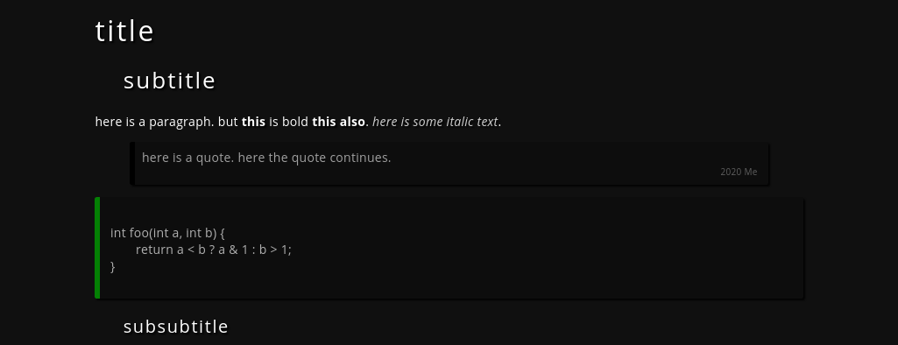

<!-- 19.06 2020 -->

This script formats markdown-like syntax into HTML.




## differences from markdown
  - `/`    defines <i>italic</i> text `normal /italic/ normal`
  - `*`    defines **bold** text
  - <code>&#96;</code>  defines inline code
  - `+ `   will be translated into ordered list
  - `>> `  is used to specify quote author
  - `---`  translates into horizontal line
  - Paragraphs are separated by 2 blank lines
  - Only 3 titles are recognized (`#` to `###`)
  - <code>&#96;&#96;&#96;</code>  on it's own line will begin/end code block

### references and images
`.IMG ` and `.REF ` at beginning of line specify images and links.
Source, or reference comes first, then the name after ` | ` separator.
```
.IMG pic.png | picture
.REF example.html | example
```

## default style
by default markdown.awk includes link to main.css, if you want
to change it, edit the makrdown.awk's BEGIN block.
